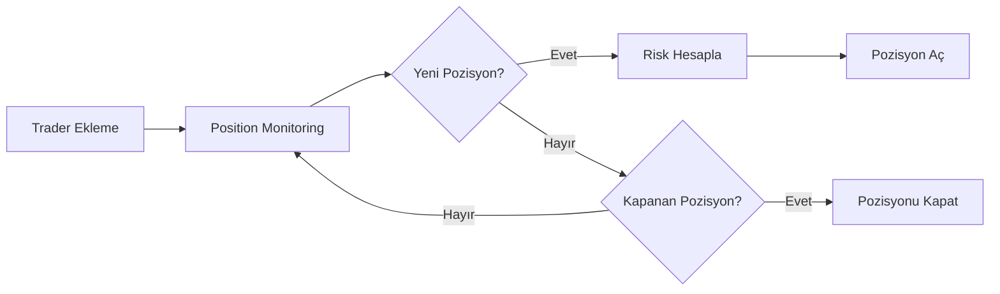

# 🚀 Copy Trading Hızlı Başlangıç Kılavuzu

## Özet

Binance Futures'da başarılı yatırımcıların pozisyonlarını otomatik olarak aynalayan bir sistem hazırladım.

**Durum:** ✅ %80 Hazır - Position monitoring ve mirroring altyapısı çalışıyor, sadece trader UID'lerini eklemeniz gerekiyor.

## 📋 Neler Hazır?

### ✅ Tamamlananlar:

1. **Copy Trading Engine** (`copy_trader.py`)
   - Trader pozisyonlarını real-time izleme
   - Otomatik pozisyon aynalama
   - Risk yönetimi (position sizing, leverage limits)
   - Equity tracking

2. **CLI Araçları**
   - `add_trader.py` - Manuel trader ekleme/çıkarma
   - `run_copy_trader.py` - Monitoring başlatma/durdurma
   - `run_copy_trader.py status` - Aktif durum kontrolü

3. **Konfigürasyon**
   - `.env` dosyasında copy trading ayarları
   - JSON-based trader database
   - Backup sistemi

4. **Dokümantasyon**
   - Teknik dokümantasyon (`COPY_TRADING.md`)
   - Durum raporu (`COPY_TRADING_STATUS.md`)
   - Bu hızlı başlangıç kılavuzu

## 🎯 Nasıl Çalışır?



## 🏁 5 Adımda Başlangıç

### Adım 1: Trader UID'leri Toplayın

1. Binance Leaderboard'u açın: https://www.binance.com/en/futures-activity/leaderboard
2. Başarılı bir trader'a tıklayın
3. URL'den UID'yi kopyalayın:
   ```
   https://www.binance.com/.../encryptedUid=0C2123F5688F316245836C60A66F8240
   ```

**İpucu:** Top 10-20 trader'dan 5-10 tanesini seçin.

### Adım 2: Trader'ları Sisteme Ekleyin

```bash
cd /Users/macbook/Downloads/testtt/predmarket-scanner

# Activate venv
source .venv/bin/activate

# Trader ekle
python scripts/add_trader.py add \
  --uid "0C2123F5688F316245836C60A66F8240" \
  --nickname "CryptoKing" \
  --roi 85.5 \
  --rank 5
```

**Birden fazla trader için:**

`traders.csv` dosyası oluşturun:
```csv
0C2123F5688F316245836C60A66F8240,CryptoKing,85.5,5
ABC123DEF456GHI789,TradeMaster,72.3,12
XYZ789UVW012MNO345,AlphaWolf,95.1,2
```

Sonra import edin:
```bash
python scripts/add_trader.py import-uids --file traders.csv --format csv
```

### Adım 3: Trader Listesini Kontrol Edin

```bash
python scripts/add_trader.py list-traders
```

Çıktı:
```
┏━━━━━━━━━━━━━┳━━━━━━━━━━━━━━━━┳━━━━━━━━┳━━━━━━┳━━━━━━━━━━━━━━━━━━┳━━━━━━━━━━━━┳━━━━━━━━┓
┃ Nickname    ┃ UID            ┃ ROI %  ┃ Rank ┃ Position Limits  ┃ Multiplier ┃ Active ┃
┡━━━━━━━━━━━━━╇━━━━━━━━━━━━━━━━╇━━━━━━━━╇━━━━━━╇━━━━━━━━━━━━━━━━━━╇━━━━━━━━━━━━╇━━━━━━━━┩
│ CryptoKing  │ 0C2123F5688... │  85.5  │   #5 │ $50-$500         │        1x  │    ✓   │
│ TradeMaster │ ABC123DEF45... │  72.3  │  #12 │ $50-$500         │        1x  │    ✓   │
└─────────────┴────────────────┴────────┴──────┴──────────────────┴────────────┴────────┘
```

### Adım 4: Dry-Run Mode ile Test Edin

```bash
# Test mode - gerçek trade açmaz
python scripts/run_copy_trader.py monitor --dry-run
```

**Ne göreceksiniz:**

```
🚀 Copy Trading Engine Started
  Mode: DRY RUN
  Max Traders: 10
  Max Mirror Positions: 5
  Copy Capital: $1500.00

⏱ 2026-05-18 17:30:00 UTC - Scanning positions...
Found 8 total positions from 3 traders

🔷 DRY RUN: Would mirror CryptoKing's LONG BTCUSDT @ 65432.10 ($250.00, 5x)
🔷 DRY RUN: Would mirror TradeMaster's SHORT ETHUSDT @ 3245.67 ($180.00, 3x)

Active mirrored positions: 0/5
```

**Kontrol edin:**
- Trader'ların pozisyonları görülebiliyor mu?
- Position sizing mantıklı mı?
- Leverage limitleri uygun mu?

### Adım 5: Live Trading'e Geçin (İsteğe Bağlı)

⚠️ **DİKKAT: GERÇEK TRADE AÇAR!**

```bash
# Live mode
python scripts/run_copy_trader.py monitor --live
```

## ⚙️ Konfigürasyon

`scenarios/binance_futures_demo.env` dosyasını düzenleyin:

```bash
# Copy trading aktif/pasif
BN_FUT_COPY_ENABLED=1

# Maksimum takip edilecek trader sayısı
BN_FUT_COPY_MAX_TRADERS=10

# Minimum trader ROI (%) - bu değerin altındaki traderlar takip edilmez
BN_FUT_COPY_MIN_ROI=50.0

# Minimum trader Win Rate (0-1)
BN_FUT_COPY_MIN_WR=0.0

# Maksimum eş zamanlı aynalanan pozisyon sayısı
BN_FUT_COPY_MAX_POSITIONS=5

# Total sermayenin yüzde kaçı copy trading için ayrılacak
BN_FUT_COPY_ALLOCATION_PCT=30.0

# Pozisyon kontrolü aralığı (saniye)
BN_FUT_COPY_REFRESH_SEC=60

# Yeni trader keşif aralığı (saniye) - manuel ekleme için kullanılmıyor
BN_FUT_COPY_DISCOVER_SEC=3600
```

## 🛡️ Risk Yönetimi

### Sermaye Ayırma

- Total sermayenizin sadece `BN_FUT_COPY_ALLOCATION_PCT` kadarı copy trading için kullanılır
- Örnek: $5000 sermaye, %30 allocation → $1500 copy trading için

### Pozisyon Büyüklüğü

Sistem otomatik olarak hesaplar:

```python
copy_capital = $5000 * 0.30 = $1500
base_per_trader = $1500 / 3 traders = $500

# Trader ROI'sine göre ağırlıklandırma
CryptoKing (ROI 85%) → $500 * 0.85 = $425
TradeMaster (ROI 72%) → $500 * 0.72 = $360

# Min/max clamp
$425 → clamped to $50-$500 range → $425 ✓
```

### Leverage Limitleri

- Trader'ın leverage'ı ne olursa olsun, sizin leverage'ınız **max 10x**'e sınırlanır
- `.env` dosyasında `BN_FUT_LEVERAGE_MAX` ile değiştirilebilir

### Maksimum Pozisyon Sayısı

- Aynı anda max `BN_FUT_COPY_MAX_POSITIONS` kadar pozisyon açılır
- Diversification için önerilir: 5-8 pozisyon

## 📊 Monitoring ve Kontrol

### Aktif Durumu Görmek

```bash
python scripts/run_copy_trader.py status
```

### Trader'ı Pasif Yapmak

```bash
python scripts/add_trader.py toggle --uid "0C2123F5688..."
```

### Trader'ı Silmek

```bash
python scripts/add_trader.py remove --uid "0C2123F5688..."
```

### Trader Parametrelerini Değiştirmek

`data/copy_trading/tracked_traders.json` dosyasını manuel editleyebilirsiniz:

```json
{
  "0C2123F5688F316245836C60A66F8240": {
    "nickname": "CryptoKing",
    "min_position_usd": 100.0,     // Bu trader için min pozisyon
    "max_position_usd": 300.0,     // Bu trader için max pozisyon
    "copy_multiplier": 0.5,        // Pozisyonları %50 boyutunda aç
    "is_active": true              // Aktif olarak takip et
  }
}
```

## 🔧 Troubleshooting

### "No positions found"

**Neden:** Trader pozisyon paylaşmıyor ya da hiç açık pozisyonu yok.

**Çözüm:** Leaderboard'da "Position Shared" işaretli traderları seçin.

### "API error 404"

**Neden:** UID yanlış ya da trader artık leaderboard'da değil.

**Çözüm:** UID'yi kontrol edin, gerekirse güncelleyin.

### Pozisyon açılmıyor (dry-run'da bile görünmüyor)

**Neden:** Trader'ın pozisyonu API'den erişilebilir değil.

**Çözüm:** Farklı bir trader deneyin.

## 🎯 Best Practices

### 1. Trader Seçimi

✅ **İyi Seçim:**
- Top 50'de yer alan
- ROI > %50
- Çeşitli coinlerde işlem yapan
- Pozisyon paylaşan

❌ **Kötü Seçim:**
- Sadece bir coinde işlem yapan
- Çok yüksek leverage (>20x) kullanan
- Track record'u olmayan yeni çıkmış traders

### 2. Diversification

- Minimum 3-5 farklı trader takip edin
- Farklı stil/stratejilere sahip traders seçin
- Hem long hem short yapanları dahil edin

### 3. Monitoring

- İlk hafta günde 2-3 kez kontrol edin
- Performance'ı takip edin
- Kötü performans gösterenleri pasif yapın

### 4. Capital Management

- Copy trading için total sermayenizin max %30-40'ını ayırın
- Geri kalanını ana stratejiniz için saklayın
- İki sistem birbirinden izole çalışır

## 🚨 Önemli Notlar

1. **Bu sistem eğitim/strateji modülünden BAĞIMSIZ çalışır**
   - Ana stratejiniz kendi watchlist'inde çalışmaya devam eder
   - Copy trading parallel çalışır, çakışma olmaz

2. **Position timing**
   - Trader pozisyon açtığında, siz 30-90 saniye içinde açarsınız (refresh interval'e bağlı)
   - Entry price tam aynı olmayabilir (slippage)

3. **Exit timing**
   - Trader kapattığında, siz de kapatırsınız
   - Max 60 saniye delay (refresh interval)

4. **Komisyonlar**
   - Hem sizin hem trader'ın işlem komisyonları var
   - Net PnL hesaplarken komisyonları göz önünde bulundurun

## 📈 Performans Takibi

Gelecekte eklenecek özellikler:

- [ ] Performance analytics dashboard
- [ ] Per-trader PnL tracking
- [ ] Win rate calculation
- [ ] Telegram notifications
- [ ] Auto-disable underperforming traders

Şu an için `data/copy_trading/mirrored_positions.json` dosyasından manuel analiz yapabilirsiniz.

## ❓ Sorularınız için

Sistem hakkında sorularınız varsa:

1. `COPY_TRADING_STATUS.md` - Teknik detaylar ve limitasyonlar
2. `COPY_TRADING.md` - Tam dokümantasyon
3. `EXAMPLE_TRADERS.md` - Trader bulma ve ekleme rehberi

## 🎉 Başarılar!

Artık copy trading sisteminiz kullanıma hazır. İyi kazançlar!

---

**Hazırlayan:** Claude Sonnet 4.5  
**Tarih:** 2026-05-18  
**Versiyon:** 1.0
