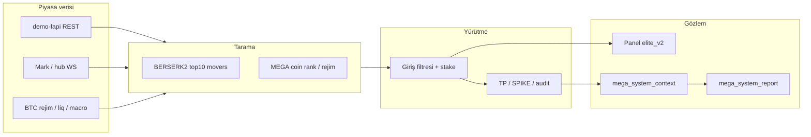

# Binancex / Predmarket-Scanner — Proje Genel Bakış

Bu belge, **binancex** deposunun ne yaptığını, nasıl organize olduğunu ve günlük geliştirme/işletmede hangi parçalara bakılacağını özetler.

---

## 1. Ne bu proje?

**binancex**, asıl kod tabanının `predmarket-scanner/` altında olduğu bir **kripto türevleri trading ve araştırma** deposudur. İki katman bir arada yaşar:

| Katman | Açıklama |
|--------|----------|
| **Kök iskelet** | Prediction market (Polymarket vb.) için edge/Kelly tarama, paper book, whale-copy mantığı — `README.md`, `main.py`, `core/`, `markets/` |
| **Elite / MEGA (asıl üretim)** | Binance USDT-M Futures üzerinde çok portlu botlar: tarama, giriş/çıkış, panel, öğrenen parametreler, demo-fapi canlı emir |

Güncel operasyonel odak **Binance Futures Elite** ve özellikle **MEGA (9006)** ile **BERSERK2 (9005)** masalarıdır. Tahmin piyasası kodu referans ve deney alanı olarak durur; canlı kâr hedefi bu Elite katmandadır.

---

## 2. Repo yapısı

```
binancex/                          # Git kökü
├── README.md                      # Kısa kurulum + MEGA 9006 işaretçileri
└── predmarket-scanner/            # Tüm uygulama
    ├── binance_elite_pro.py       # Ana FastAPI + motor girişi
    ├── binance_elite_pro_9005.py  # BERSERK2 (port 9005)
    ├── binance_elite_pro_9006.py  # MEGA canlı (port 9006)
    ├── elite_trader/              # Tarama, çıkış, rejim, hub, MEGA modülleri (~170 dosya)
    ├── panel/elite_v2/            # Web panel (HTML/JS)
    ├── scenarios/                 # Port bazlı .env senaryoları (commit edilebilir)
    ├── scripts/                   # Process ctl, reset, rapor, deploy yardımcıları
    ├── deploy/                    # GCP runbook ve restore script’leri
    ├── data/                      # SQLite, JSON kapanışlar, öğrenme — git dışı
    ├── docs/                      # Checkpoint, kurulum, bu dosya
    └── requirements.txt
```

**Git’e girmeyen (yerelde tutulur):** `.env`, `scenarios/.env.mega_*`, `data/`, `*.db`, API anahtarları, Telegram token’ları.

---

## 3. Ana masalar (portlar)

Her port = ayrı HTTP panel + ayrı senaryo env + çoğunlukla ayrı süreç/veri.

| Port | Profil | Rol |
|------|--------|-----|
| **9005** | BERSERK2 | Demo-fapi **canlı emir**; günün en hareketli ~10 perpetual + BTC 5m rejim; hızlı micro-scalp |
| **9006** | MEGA | Demo-fapi **canlı MEGA emir**; BERSERK2 taramasını kullanır ama **ayrı process ve hesap**; ~$5k cüzdan, slot stake, TP-only çıkış profili |
| **9007** | MEGA lab | Paper/sim ve zarar kesimi deneyleri (`mega_loss_cut_lab.env`) |
| 8200–8210 | ELITE APEX / formula | Paper compound, formula öğrenme, farklı TP/SL profilleri |
| 9004 | Agresif evren | Tam USDT-M evren taraması |

Detaylı env tabloları: `AYARLAR_TUM_PORTLAR.md`.  
9005 handoff: `HANDOFF_CURSOR.md`.  
9006 senaryo: `scenarios/binance_elite_mega_9006_mainnet.env` (~800 satır parametre).

### 9005 vs 9006 (sık sorulan)

- **9005** kendi başına BERSERK2 motorunu çalıştırır (`ELITE_ENABLED_MODES=berserk2`).
- **9006** berserk2 **motor thread’ini çalıştırmaz**; tarama sinyallerini berserk2 hattından alıp MEGA giriş/çıkış kurallarıyla işler.
- İkisi **farklı Binance API anahtarı** ve farklı veri klasörü kullanmalıdır (`data/` vs `data/mega_9006/`).

---

## 4. Yazılım mimarisi (özet)



### Önemli modüller

| Modül / dosya | Görev |
|---------------|--------|
| `elite_trader/scanner.py` | Ana döngü, tarama, TP/SL (klasik Elite) |
| `elite_trader/berserk2_movers.py` | Dinamik top-10 evren |
| `elite_trader/berserk2_btc_context.py` | BTC trend → stake/veto |
| `elite_trader/mega_*` | MEGA giriş, rejim, hub, pozisyon senkronu, volatilite |
| `elite_trader/mega_system_context.py` | İşlem anı sistem snapshot (P0) |
| `elite_trader/mega_system_report.py` | Günlük sistem raporu (P1) |
| `elite_trader/mega_system_score.py` | Skor kapısı (P2, varsayılan kapalı) |
| `elite_trader/btc_liq_feed.py` | Likidasyon / panel önbellek |
| `elite_trader/exchange_fill_truth.py` | Kapanış PnL = REST fill gerçeği |
| `binance_data_hub.py` | Mark ve REST bütçesi |

**İlke (9005/9006):** Açık pozisyon, mark, fill ve kapalı işlem PnL/komisyonu mümkün olduğunca **Binance REST** (`positionRisk`, `bookTicker`, `userTrades`) ile doğrulanır; panel cache pozisyon gerçeğinin üzerine yazmaz.

### Sistem-bot evrimi (MEGA checkpoint)

Piyasa yorumunun yanına **sinyal × yürütme × sistem sağlığı** katmanı ekleniyor:

- **P0** — Her işlemde `entry_context` / `exit_context` / audit `system_context` (mantığı değiştirmez, ölçer).
- **P1** — Periyodik `mega_system_report` + Telegram/JSON.
- **P2** — `MEGA_SYSTEM_SCORE_GATE` (şu an `0`, canlıda kapalı).

Ayrıntı: `docs/MEGA_SYSTEM_BOT_CHECKPOINT.md`.

---

## 5. Çalıştırma (tipik)

```bash
cd predmarket-scanner
python3 -m venv .venv && source .venv/bin/activate
pip install -r requirements.txt
# .env ve scenarios/.env.mega_* eski makineden kopyalanır (gizli)
```

| Bot | Komut | Panel |
|-----|--------|-------|
| BERSERK2 9005 | `./scripts/elite_9005_process_ctl.sh start` | http://127.0.0.1:9005 |
| MEGA 9006 | `./scripts/elite_9006_process_ctl.sh restart` veya `./run_binance_elite_mega_9006.sh` | http://127.0.0.1:9006/paper |
| MEGA 9007 lab | `./scripts/elite_9007_process_ctl.sh restart` | http://127.0.0.1:9007/paper |

Log örnekleri: `logs/binance_elite_8300_9005.log`, `logs/binance_elite_mega_9006.log`.

GCP’de 9006 checkpoint deploy: `deploy/gcp_9006_restore_chat_checkpoint.sh` (veri silmez, env+kod).

---

## 6. Veri ve koruma kuralları

| Veri | Konum | Not |
|------|--------|-----|
| 9005 state / learner | `binance_elite_8300_9005_state.db`, lessons, proposals | **Asla** kullanıcı istemeden silinmez |
| 9006 kapanışlar | `data/mega_9006/mega_live_closed.json` | `entry_context`, `exit_context` |
| 9006 audit | `data/mega_9006/mega_close_audit.jsonl` | Kapanış denemeleri |
| 9007 | `data/mega_9007/` | 9006’dan izole |

Reset: `./scripts/reset_binance_elite_9005.sh` varsayılan olarak veriyi **korur**; tam silme yalnızca `--wipe-data --reason "..."` ile.  
Detay: `DATA_PRESERVATION_9005.md`, Cursor kuralı: `.cursor/rules/9005-data-preservation.mdc`.

---

## 7. Konfigürasyon modeli

1. Kök `predmarket-scanner/.env` — API anahtarları, global bayraklar.
2. `scenarios/<profil>.env` — Port/profil override (yüklenme sırasında **senaryo kazanır**).
3. Admin panel / runtime — Bazı bayraklar restart gerektirir.

Örnek 9006 canlı bayrakları (checkpoint):

- `MEGA_SYSTEM_CONTEXT_ENABLED=1` — sistem bağlamı kaydı
- `MEGA_SYSTEM_SCORE_GATE=0` — skor kapısı kapalı
- `MEGA_UNDERWATER_CUT=0`, `MEGA_DISABLE_SL_EXIT=1` — canlıda SL/su-altı kesimi kapalı
- `MEGA_LIVE_ORDERS=1` — MEGA demo canlı emir

---

## 8. Dokümantasyon haritası

| Konu | Dosya |
|------|--------|
| Bu özet | `docs/PROJE_GENEL_BAKIS.md` |
| Kök kurulum | `../README.md` |
| Prediction market iskelet | `README.md` (predmarket-scanner) |
| Tüm port env tablosu | `AYARLAR_TUM_PORTLAR.md` |
| 9005 devam rehberi | `HANDOFF_CURSOR.md` |
| BERSERK2 davranış | `BERSERK2_MODE_PROFILE.md` |
| MEGA sistem checkpoint | `docs/MEGA_SYSTEM_BOT_CHECKPOINT.md` |
| 9006 sıfırdan kurulum amacı | `docs/MEGA_9006_SIFIRDAN_KURULUM_AMAC.md` |
| 9007 canlı geçiş | `MEGA_9007_LIVE_TRANSITION.md` |
| Tam yedek/geri yükleme | `GERI_YUKLEME_PROJE.md` |
| GCP mainnet | `deploy/GCP_MAINNET_RUNBOOK.md` |
| 9005 loss learner | `docs/ELITE_9005_LOSS_LEARNER.md` |

---

## 9. Risk ve beklenti

- Tweet/README’deki yüksek getiri iddiaları **pazarlama örneğidir**; bu repo doğru mimariyi ve ölçümü kurar, garanti getiri vermez.
- Demo-fapi ile mainnet arasında gecikme, fill ve funding farkı vardır.
- Paper compound (8200/8300) sonuçları canlıda bire bir tekrarlanmayabilir.
- P0/P1 sistem bağlamı **tek başına win rate artırmaz**; optimizasyon P2+ ve öğrenilmiş env ile gelir.

---

## 10. Tek cümlelik özet

**binancex**, Binance Futures üzerinde çok profilli (BERSERK2, MEGA, Elite APEX) otomatik tarama ve yürütme yapan, REST-gerçekli pozisyon/PnL, panel ve öğrenen parametrelerle işletilen bir trading masasıdır; kökte ayrıca prediction-market araştırma iskeleti bulunur.
